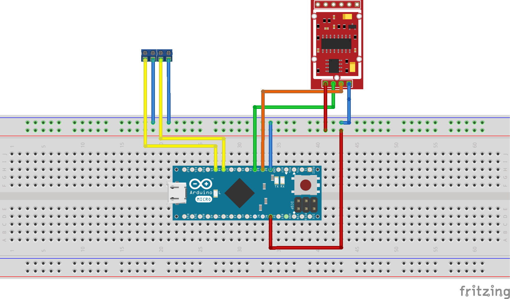

# Handbrake Controller

This project is a simulator of a handbrake and gear shifter controller for simulation racing. It uses an Arduino board along with the HX711 amplifier for load cells and the Arduino Joystick library to emulate a joystick's handbrake action and gear shifting. 

The simulator reads settings from the EEPROM or the serial port to adjust parameters like the curve type, minimum and maximum raw handbrake, and curve factor. The handbrake's response and gear shifting actions are then modulated accordingly.

Complementary GUI software for this project is accessible [here](https://github.com/andersalavik/simrig-controller-gui).

## Credits

Many thanks go to ChatGPT and CoPilot for their invaluable assistance in realizing this project.

## Requirements

* Arduino Board
* HX711 amplifier
* Load cell
* Two momentary switches for gear shifting
* Arduino IDE or PlatformIO IDE

## Connections

The load cell is connected to the HX711 amplifier, which is then connected to the Arduino board. The momentary switches are connected to the Arduino board as well. The connections are as follows:

* HX711 amplifier:
  * Arduino:
    * VCC -> 5V
    * GND -> GND
    * DT -> D2
    * SCK -> D3
  * Load cell:
    * Red -> E+
    * Black -> E-
    * White -> A-
    * Green -> A+
* Momentary switches:
  * Arduino:
    * Gear up -> D7 , GND
    * Gear down -> D8, GND

## Usage

1. Open the project in the Arduino IDE or PlatformIO IDE.
2. Upload the Arduino sketch (found in `src/main.cpp` if using PlatformIO) to your Arduino board.
3. After uploading the sketch and connecting the Arduino to your PC, send commands over the serial port to adjust the handbrake's settings.

## Serial Commands

Available commands include:

* `c`: Change curve type (send integer value between 0-2, where 0 = LINEAR, 1 = EXPONENTIAL, 2 = LOGARITHMIC)
* `m`: Change minimum raw handbrake value (send float value)
* `t`: Change maximum raw handbrake value (send float value)
* `f`: Change curve factor (send integer value, which is divided by 10 in the code)
* `s`: Save current settings to EEPROM
* `e`: Enable setup mode
* `w`: Disable setup mode
* `r`: Read and print current settings

When setup mode is enabled (`e` command), the raw and processed handbrake values, as well as gear up and down actions, are printed to the serial port.

## Troubleshooting/FAQ

* **Serial communication is not working**: Ensure your Arduino is correctly connected and the appropriate COM port is selected in your IDE. Additionally, verify that the baud rate in your Arduino IDE matches the baud rate set in the code (9600).
  
* **The curve factor is not changing**: Multiply your desired factor by 10 before sending, as the code divides the input by 10. For example, if you want a factor of 1.5, send 15.

* **Values aren't saved after power loss**: After adjusting the settings, use the 's' command to store the current settings to the EEPROM.

* **The handbrake isn't responsive or is behaving erratically**: Confirm the load cell and HX711 amplifier are correctly connected and functioning. Check your wiring and consider calibrating the load cell.

* **Gear shifting is not working correctly**: Check the wiring and connections of your momentary switches. Make sure the code corresponds to the correct pins on the Arduino board.

## Contributing

Contributions are welcome and greatly appreciated! You can help improve the Handbrake Controller project in many ways. For instance:

* Submit bugs and feature requests, and help verify them as they are checked in.
* Review source code changes.
* Engage with other Handbrake Controller users and developers on GitHub.
* Contribute bug fixes or new features.

Before you contribute, please read through the contributing guide. Here is a quick guide on how to contribute:

1. Fork the repository (https://github.com/andersalavik/simrig-controller/fork).
2. Clone the project to your own machine (`git clone https://github.com/your-username/simrig-controller.git`).
3. Create a branch on your local machine to make your changes (`git checkout -b feature/fooBar`).
4. Commit your changes (`git commit -am 'Add some fooBar'`). Ensure to adhere to good coding standards and styles.
5. Push your changes back to your fork (`git push origin feature/fooBar`).
6. Submit your changes as a Pull Request, ensuring that the PR description clearly describes your changes.

Please note that this project is released with a [Contributor Code of Conduct](CODE_OF_CONDUCT.md). By participating in this project, you agree to abide by its terms.

## License

This project is licensed under the GNU General Public License v3.0. You can use, modify, and distribute this project, including for commercial purposes, but you cannot sell it. For more information, see the [LICENSE](LICENSE) file in this repository or visit [https://www.gnu.org/licenses/gpl-3.0.html](https://www.gnu.org/licenses/gpl-3.0.html).
